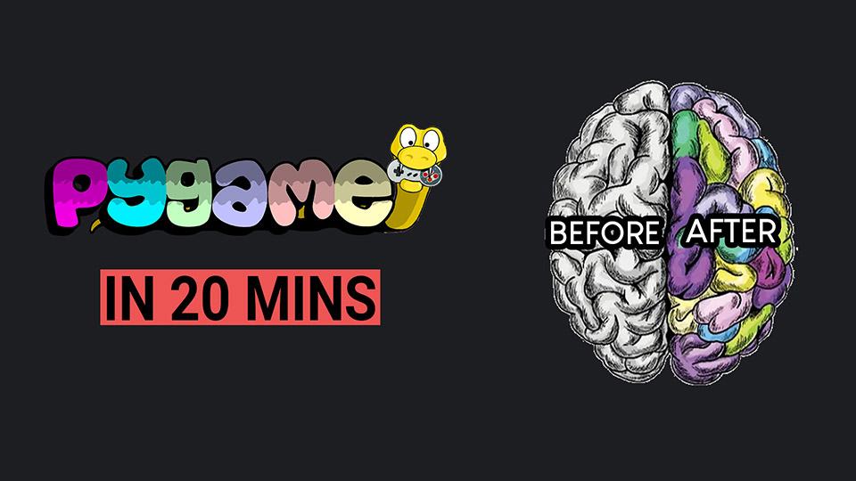

# Get Started in pygame in 20 minutes - Python
Welcome to the easiest introduction to game development with pygame in python. If you're new to pygame, you're in the right place to start your journey. In this video, I will guide you through the installation process of pygame on your Windows computer and we are going to build a simple pygame project from scratch. We'll be using Python with Sublime Text to develop a basic pygame program featuring a keyboard-controlled ball. The entire procedure is very easy and should take no more than 20 minutes.

# How to use this project
1. Open the main.py file with Sublime Text.
2. Press CTRL + B on you keyboard to run it.

# Video Tutorial

  

🎥 <a href = "https://youtu.be/HUMe0tZ8T34">Video Tutorial on YouTube</a>

 
 

| 📺 <a href="https://www.youtube.com/channel/UC3ivOTE5EgpmF2DHLBmWIWg">My YouTube Channel</a>
| 🌍 <a href="http://www.educ8s.tv">My Website</a> |  

